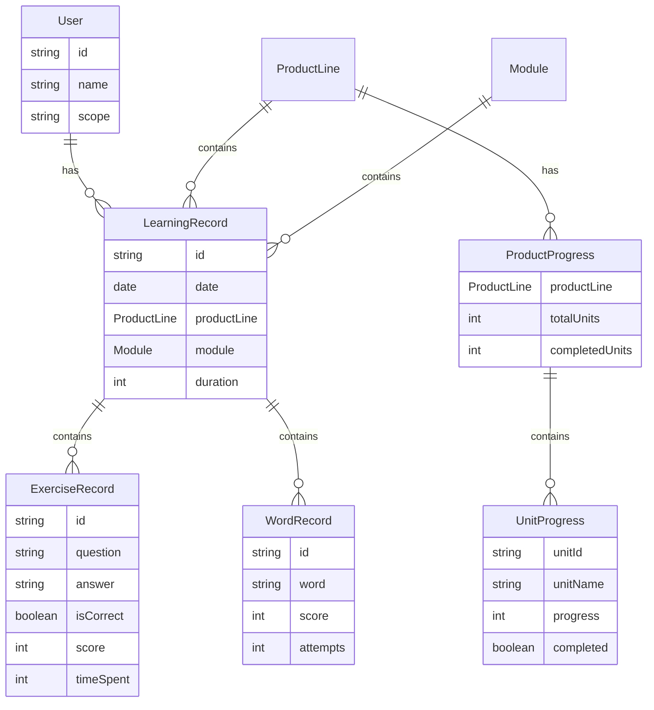
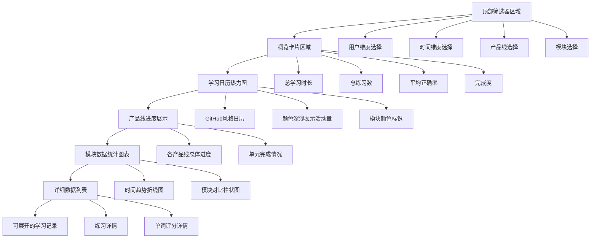
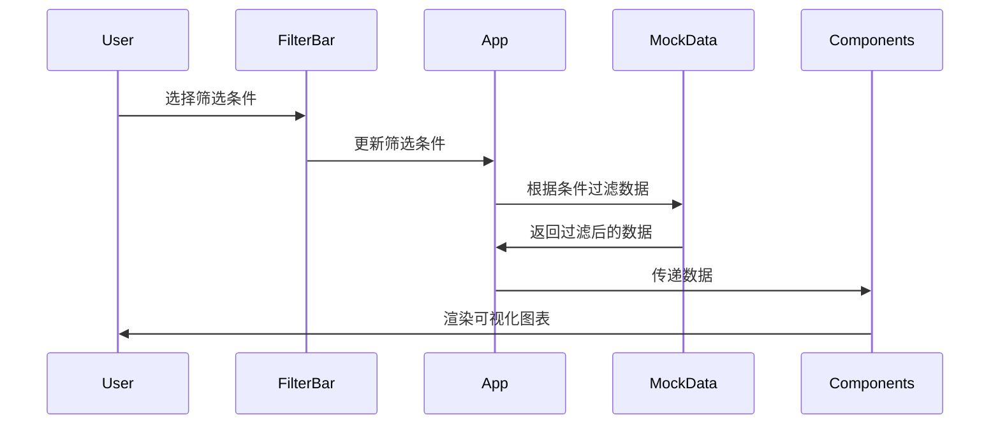

# 英语学习学情数据看板 - 架构设计文档

## 一、产品架构设计

### 1.1 数据维度架构

```
┌─────────────────────────────────────────────────────────┐
│                    用户维度 (第一层)                      │
│  ┌─────────┬─────────┬─────────┬─────────┬──────────┐  │
│  │单个用户 │  班级   │  学校   │  地区   │自定义分群 │  │
│  └─────────┴─────────┴─────────┴─────────┴──────────┘  │
└─────────────────────────────────────────────────────────┘
                          ↓
┌─────────────────────────────────────────────────────────┐
│                    时间维度 (第二层)                      │
│  ┌──────┬──────┬──────┬──────┬──────────┐              │
│  │当天  │近一周│近一月│近一年│自定义范围│              │
│  └──────┴──────┴──────┴──────┴──────────┘              │
└─────────────────────────────────────────────────────────┘
                          ↓
┌─────────────────────────────────────────────────────────┐
│              产品线与模块维度 (第三层)                     │
│                                                          │
│  ┌──────────────┐  ┌──────────────┐  ┌──────────────┐ │
│  │  校内同步    │  │ 新概念英语   │  │    作业      │ │
│  │ ├─单词跟读   │  │ ├─单词跟读   │  │ └─作业模块   │ │
│  │ ├─配音       │  │ ├─配音       │  │              │ │
│  │ ├─点读       │  │ └─练习       │  │              │ │
│  │ └─练习       │  │              │  │              │ │
│  └──────────────┘  └──────────────┘  └──────────────┘ │
│                                                          │
│  ┌──────────────┐                                       │
│  │  单词专区    │                                       │
│  │ └─单词专区   │                                       │
│  └──────────────┘                                       │
└─────────────────────────────────────────────────────────┘
```

### 1.2 数据模型设计



### 1.3 页面布局架构



## 二、技术实现架构

### 2.1 技术栈

- **前端框架**: React 18 + TypeScript
- **构建工具**: Vite
- **样式方案**: Tailwind CSS
- **数据可视化**: Recharts
- **日期处理**: date-fns
- **日历热力图**: 自定义实现（参考GitHub风格）

### 2.2 目录结构

```
src/
├── types/              # TypeScript类型定义
│   └── index.ts
├── data/               # Mock数据生成
│   └── mockData.ts
├── components/         # React组件
│   ├── FilterBar.tsx          # 筛选器组件
│   ├── OverviewCards.tsx       # 概览卡片
│   ├── CalendarHeatmap.tsx     # 日历热力图
│   ├── ProductProgress.tsx     # 产品线进度
│   ├── ModuleCharts.tsx        # 模块统计图表
│   └── DetailList.tsx          # 详细数据列表
├── App.tsx             # 主应用组件
├── main.tsx            # 应用入口
└── index.css           # 全局样式
```

### 2.3 数据流设计



## 三、核心功能实现

### 3.1 筛选功能

支持三层筛选：
1. **用户维度**: 单个用户/班级/学校/地区/自定义分群
2. **时间维度**: 当天/近一周/近一月/近一年/自定义范围
3. **产品线与模块**: 多选产品线和模块

### 3.2 日历热力图

- 参考GitHub贡献图设计
- 每个格子代表一天
- 颜色深浅表示学习活动量（0-4级）
- 支持悬停显示详细信息
- 底部显示模块颜色图例

### 3.3 数据可视化

- **时间趋势图**: 折线图展示学习时长、练习数、正确率随时间变化
- **模块对比图**: 柱状图对比不同模块的活动次数和平均分
- **产品线进度**: 进度条展示各产品线的单元完成情况

### 3.4 详细数据展示

- 可展开的学习记录列表
- 展示练习详情（题目、答案、正确性、得分）
- 展示单词跟读详情（单词、评分、尝试次数）

## 四、Mock数据设计

### 4.1 数据生成策略

- **学习记录**: 随机生成过去365天的学习活动
- **产品线进度**: 随机生成各产品线的单元完成情况
- **统计数据**: 基于学习记录实时计算

### 4.2 数据真实性

- 每天0-3次学习活动
- 练习模块包含3-15道题
- 单词跟读模块包含3-10个单词
- 正确率在60%-100%之间
- 学习时长在5-60分钟之间

## 五、UI/UX设计

### 5.1 配色方案

- **主色调**: 蓝色系（#0ea5e9）
- **成功色**: 绿色（#10b981）
- **警告色**: 黄色（#f59e0b）
- **错误色**: 红色（#ef4444）
- **背景色**: 浅灰色（#f9fafb）

### 5.2 交互设计

- 卡片悬停效果
- 可展开的详细列表
- 响应式布局（支持移动端）
- 平滑的过渡动画

## 六、扩展性设计

### 6.1 数据源扩展

当前使用Mock数据，后续可轻松替换为真实API：
- 封装数据获取逻辑
- 统一数据接口格式
- 支持数据缓存

### 6.2 功能扩展

- 支持导出数据
- 支持数据对比（多用户/多时间段）
- 支持自定义报表
- 支持数据钻取

